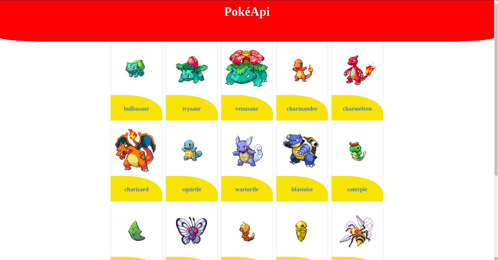

<h1 align="center">
    
</h1>

<p align="center">
  <a href="#-technologies">Technologies</a>&nbsp;&nbsp;&nbsp;|&nbsp;&nbsp;&nbsp;
  <a href="#-preview">Preview</a>&nbsp;&nbsp;&nbsp;|&nbsp;&nbsp;&nbsp;
  <a href="#-layout">Getting started</a>&nbsp;&nbsp;&nbsp;|&nbsp;&nbsp;&nbsp;
  <a href="#-project">Project</a>&nbsp;&nbsp;&nbsp;|&nbsp;&nbsp;&nbsp;
</p>
<br>

## 🧪 Technologies

This project was developed using the following technologies:

- [React](https://reactjs.org)
- [SCSS](https://sass-lang.com)

## 🔥 Preview

[](https://apipokemon-2v1bbtiqx-matheusleal-code.vercel.app/)

## 🚀 Getting started

Clone the project and access the folder

```bash
$ git clone https://github.com/matheusleal-code/pokeapi.git && cd pokeapi
```

Follow the steps below

```bash
# Install the dependencies
$ npm install

# Start the project
$ npm start
```

## 💻 Project

[PokéApi](https://apipokemon-2v1bbtiqx-matheusleal-code.vercel.app/) An application to get to know pokémons better
